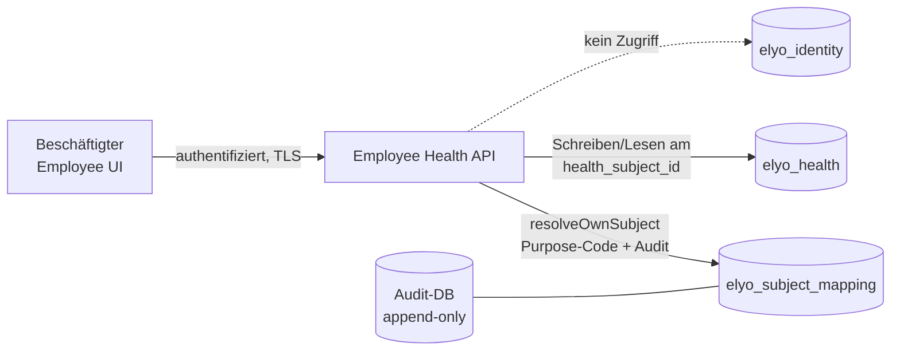
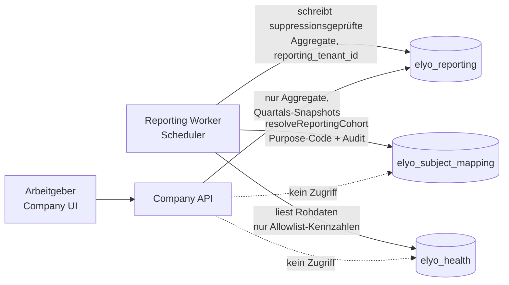

# DSFA-Vorprüfung: Produktive Laborwerte- und Check-in-Verarbeitung (ELYO-101)

| Feld | Wert |
|---|---|
| **Version** | 1.0 (Entwurf zur Übergabe) |
| **Datum** | 2026-07-12 |
| **Autor** | Tech-Lead (technische Zuarbeit) |
| **Empfänger** | Interne Kontrollperson (ELYO-100/18.1); extern-tauglich strukturiert |
| **Grundlage** | ADR-001, ADR-002, ELYO-101-Entscheidungsbogen, Gap-Analyse `docs/ai-reviews/demo-employee-lab-values-dashboard-gap-analysis.md` |

> **Zweck und Grenze:** Technische Faktensammlung als Zuarbeit für die Datenschutz-Folgenabschätzung. Keine Rechtsberatung; rechtliche Wertungen (insb. Art.-9-Subsumtion, Rechtsgrundlage, DSFA-Pflicht) verbleiben bei den Datenschutz-Verantwortlichen.
>
> **Aktualisierungsvorbehalt:** Die Laborwert-Datenkategorien sind aus dem Demo-Material abgeleitet. Dieses Dokument wird nachgezogen, sobald das produktive Laborwertmodell (ELYO-105/113/114) und der Check-in-Contract (ELYO-133) festgelegt sind (Re-Review-Trigger, ADR-002 §2.8).

---

## 1. Systemkontext und Zielarchitektur (Kurzfassung ADR-001)

Elyo verarbeitet Gesundheitsdaten von Beschäftigten, deren Plattformzugang vom Arbeitgeber gesponsert wird. Der Arbeitgeber erhält ausschließlich aggregierte Reports und darf strukturell keine Rückschlüsse auf Einzelpersonen ziehen können.

Zielarchitektur (beschlossen, Umsetzung in ELYO-91 ff., **noch nicht gebaut**):

- Vier PostgreSQL-Datenbanken auf einem Cluster: `elyo_identity`, `elyo_subject_mapping`, `elyo_health`, `elyo_reporting`; separate Audit-DB (append-only, 2 Jahre).
- Verbindung Person (`user_id`) ↔ Gesundheitsprofil (`health_subject_id`) existiert nur in der Mapping-DB; Zugriff nur über fünf zweckgebundene Operationen mit Pflicht-Purpose-Code und Audit.
- Fünf Runtimes aus einem Codebestand mit je eigener DB-Rolle und Minimalrechten; die Company API hat keinerlei Zugriff auf Mapping oder Health.
- Reporting speichert nur suppressionsgeprüfte Aggregate (Mindestschwelle 10, sensibel 20; eine Kohorte je Kunde; feste Quartals-Snapshots). Medizinisch konkrete Inhalte — insbesondere **Laborwerte** — sind grundsätzlich **nicht reportbar** (Allowlist-Prinzip).
- Verschlüsselung: Volume-Verschlüsselung, Feldverschlüsselung der Mapping-Tabelle, domänengetrennte Secrets, Dokumente in eigenem Bucket mit pseudonymen Pfaden.
- Boundary-Tests erzwingen die Grenzen bei jedem Merge in CI (ADR-001 §2.10).

## 2. Verarbeitungstätigkeiten und Zwecke

| # | Verarbeitung | Zweck | Status |
|---|---|---|---|
| V1 | Laborwerte: Erfassung, Speicherung, Anzeige für den Beschäftigten | Persönliche Gesundheitsorientierung (nicht-diagnostisch: Soft-Status „unter/im/über Orientierungsbereich", Erklärtexte, Sicherheitshinweis) | Geplant; Modell in ELYO-105 neu, Schreibpfad offen (→ Frage 1) |
| V2 | Check-in: tägliche Selbsteinschätzung | Selbstreflexion des Beschäftigten; Wochenaggregate im eigenen Dashboard | Geplant (Kern-Felder); Erweiterungen entscheidungsoffen (→ Fragen 2–3) |
| V3 | Historie/Timeline (Lesepfad) | Anzeige des eigenen Verlaufs (Check-ins, perspektivisch Laborwert-Historie) | Geplant (ELYO-113/138) |
| V4 | Nachgelagert: anonyme Reporting-Aggregate aus Check-in-Wellbeing | Arbeitgeber-Reports auf Kohortenebene (Quartals-Snapshots) | Geplant; nur Allowlist-Kennzahlen, Laborwerte ausgeschlossen |

Nicht Gegenstand dieser Vorprüfung (Inventar-Anhang B): Wellbeing-Altbestand, Dokumenten-Upload, Anamnese-Profil, Survey-Antworten.

## 3. Datenkategorien

Markierung „Gesundheitsdatenbezug" rein deskriptiv: **direkt** / **abgeleitet** / **kein** (rechtliche Einordnung beim DSB).

### 3.1 Laborwerte (V1) — abgeleitet aus Demo-Material, Vorbehalt ELYO-105/113/114

| Kategorie | Felder (geplant) | Gesundheitsdatenbezug | Anmerkung |
|---|---|---|---|
| Marker-Identität | Marker-Key, Marker-Name (z. B. Hämoglobin, CRP, Ferritin) | **direkt** | Der Marker-Name selbst ist klinisch benennend — bereits die Existenz einer Zeile ist sensibel |
| Messwert | Wert + Einheit | **direkt** | |
| Einordnung | Orientierungsbereich, Soft-Status (unter/im/über Bereich) | **direkt** (abgeleitet aus Messwert) | Nicht-diagnostische Wortwahl gemäß Health Data Guardrails |
| Zeitbezug | Messdatum, Historie | **direkt** | Historie im Zielmodell von Anfang an vorgesehen (ELYO-113) |
| Provenienz | Quelle der Werte | **direkt** | **Offen:** manuelle Eingabe / Dokumentimport / BGM-Import (→ Frage 1) |
| Zuordnung | `health_subject_id` | pseudonym | Kein `user_id` in der Health-Domäne |

### 3.2 Check-in (V2) — Drei-Klassen-Trennung

| Klasse | Felder | Gesundheitsdatenbezug | Status |
|---|---|---|---|
| Sofort persistierbar | mood, energy, stress (je 1–5); Location; ggf. Sleep | **abgeleitet**/gesundheitsnah (mood/energy/stress, Sleep); **kein** (Location, Arbeitskontext) | Geplant produktiv (ELYO-133) |
| Hardening-gated | Symptome (inkl. Schmerzregionen/-stärke), Krankheitstypen | **direkt** | Erst nach ELYO-91 **und** Produktentscheidung (→ Frage 2); bis dahin nicht produktiv |
| Entscheidungsoffen | Freitext `note` (Demo: max 2000 Zeichen) | **direkt möglich** (freie Gesundheitsangaben) | Minimierung/Streichung offen (ELYO-109, → Frage 3) |

### 3.3 Nachgelagerte/abgeleitete Kategorien

| Kategorie | Gesundheitsdatenbezug | Anmerkung |
|---|---|---|
| Wochenaggregate im eigenen Dashboard (mood/energy/stress-Trends) | abgeleitet | Nur für den Beschäftigten selbst, Health-Domäne |
| Reporting-Aggregate (Kohorte, suppressionsgeprüft) | kein Personenbezug (Ziel) | `reporting_tenant_id` statt `company_id`; keine IDs; Schwellen 10/20 |
| Schonmodus-Flag, Badges (LAB-Kategorie), Maßnahmen-Teilnahme | abgeleitet | Nicht Kern-Scope; Badges „Later" (ELYO-137); im Zielmodell Health-Domäne |

## 4. Datenflüsse (Zielarchitektur)

### 4.1 V1/V2 — Erfassung und Anzeige (Schreib-/Lesepfad Beschäftigter)

- Der Beschäftigte authentifiziert sich gegen die Identity API (`user_id`); die Employee Health API löst über die Mapping-Operation `resolveOwnSubject` das eigene `health_subject_id` auf (Purpose-Code, Audit-Event) und arbeitet ausschließlich damit in `elyo_health`.
- Laborwerte und Check-ins werden nie mit `user_id` gespeichert.
- Schreibpfad Laborwerte: bis zur Provenienz-Entscheidung (Frage 1) ist nur der Lesepfad + manuelle Eingabe als Arbeitshypothese dokumentiert.

### 4.2 V3 — Historie/Timeline

Reiner Lesepfad über denselben Weg wie 4.1 (Employee Health API → `elyo_health`), keine zusätzlichen Empfänger. Leere/Fehlerzustände contract-definiert (ELYO-118/138); kein Blending mit Demo-Daten im Produktionscode.

### 4.3 V4 — Reporting-Aggregation (nachgelagert)

- Nur Allowlist-Kennzahlen (Check-in-Wellbeing-Aggregate, sofern freigegeben); **Laborwerte fließen nicht in Reporting** (ADR-001 §2.5).
- Suppression: `max(platform_minimum, customer_threshold, metric_threshold)`; Kategorien < 5 Beitragende zusammengefasst/unterdrückt; Prozente auf 5 % gerundet.
- Nur Daten aus aktiver Membership (Messdatum maßgeblich); unveränderliche Quartals-Snapshots.

### 4.4 Ausdrücklich nicht existierende Flüsse (Negativliste)

- Kein Fluss von Individual-Gesundheitsdaten an Company API, Arbeitgeber oder Admin-Rollen.
- Keine Runtime-zu-Runtime-Kommunikation; keine Runtime besitzt alle Credentials.
- Kein Export von Mapping-Auflösungen (Re-Identifizierung nur als Break-glass: Vier-Augen, Einzelfall, 24 h, Exportverbot).
- Keine Gesundheitsdaten in Logs (Boundary-Test) oder in Browser-localStorage im Prod-Modus (ELYO-134).

## 5. Speicherorte und Aufbewahrung

| Datenbestand | Speicherort | Verschlüsselung | Aufbewahrung / Löschung |
|---|---|---|---|
| Laborwerte, Check-ins, Historie | `elyo_health` (am `health_subject_id`) | Volume-Verschlüsselung | Fachliche Fristen **offen** (→ Frage 6); Account-Löschung: physisch binnen 30 Tagen, Mapping zuletzt |
| user_id ↔ health_subject_id | `elyo_subject_mapping` | Volume + Feldverschlüsselung (eigener Schlüssel) | Status nur ACTIVE/REVOKED (Tombstone); Löschung im Löschverfahren zuletzt |
| Reporting-Aggregate | `elyo_reporting` (`reporting_tenant_id`) | Volume-Verschlüsselung | Anonyme Aggregate bleiben; kundenspezifische Aggregate 12 Monate nach Kündigung |
| Audit-Events | Audit-DB (INSERT-only) | Volume-Verschlüsselung | 2 Jahre; nie `user_id` und `health_subject_id` gemeinsam |
| Backups | Domänengetrennte tägliche Dumps | verschlüsselt | 90-Tage-Rotation; Restore prüft Löschliste; Quartals-Restore-Tests |
| Consent Records | `elyo_identity` (am `user_id`) | Volume-Verschlüsselung | Append-only, versioniert, zweckgebunden |

## 6. Zugriffe und Empfänger (Runtime-/Rollen-Matrix)

| Runtime / Rolle | elyo_identity | elyo_subject_mapping | elyo_health | elyo_reporting | Audit-DB |
|---|---|---|---|---|---|
| Identity API | R/W | provisionOwnSubject | — | — | schreibt Events |
| Employee Health API | — | resolveOwnSubject | R/W | — | schreibt Events |
| Company API | R (Membership/Sponsoring) | **kein Zugriff** | **kein Zugriff** | R (Aggregate) | schreibt Events |
| Reporting Worker | — | resolveReportingCohort | R (Allowlist) | W | schreibt Events |
| Privacy/Admin-Runtime | R | revokeSubjectLink, resolveForDataSubjectRequest | R (DSR) | — | R (nur Privacy Admin) |
| Migrations-Rolle | Schema | Schema | Schema | Schema | Schema (nie in Runtime-Containern) |

Menschliche Empfänger: Beschäftigter (nur eigene Daten), Arbeitgeber (nur suppressionsgeprüfte Quartals-Aggregate), Privacy Admin (Break-glass/DSR, auditiert), Support Admin (keine Health-Daten). Keine externen Empfänger/Auftragsverarbeiter im Kern-Scope definiert; Hosting-Setup wird in der DSFA ergänzt.

## 7. Demo-Risiko-Inventar

Der Demo-Branch `demo/employee-lab-values-dashboard` ist Anschauungsmaterial für die geplanten Datenkategorien und wird **nicht fortgeführt** (ADR-001 0.6). Kein Artefakt beschreibt einen Produktionszustand. Einstufungen: Spalte „Demo-Ist" unverändert aus der Gap-Analyse; Spalte „Restrisiko Ziel (geplant)" mit adressierender Entscheidung und Umsetzungsstatus.

**Risikostufen:** **Blocker** = verhindert produktive Verarbeitung realer Daten, bis behoben · **High** = Re-Identifikation oder unbefugter Health-Zugriff realistisch möglich · **Medium** = Schutzverletzung nur unter Zusatzbedingungen / begrenzte Sensitivität · **Low** = kein personenbezogenes Risiko oder rein demo-gated.

| # | Artefakt | Dateireferenz (Branch: `demo/employee-lab-values-dashboard`) | Befund | Demo-Ist | Restrisiko Ziel (geplant) | Adressiert durch |
|---|---|---|---|---|---|---|
| R1 | `lab_markers`-Tabelle | `apps/api-laravel/database/migrations/2026_07_05_010000_create_lab_markers_table.php` | Direkter `user_id`-FK (cascade), `unique(user_id, marker_key)`, keine Historie, kein Retention-Konzept | **Blocker** | Low — Neubau am `health_subject_id` | ADR-001 §2.1/2.6; ELYO-104/105 (offen) |
| R2 | `LabMarker`-Model + Relation | `app/Models/LabMarker.php`, `User::labMarkers()` | Identity↔Health-Join per ORM trivial | **Blocker** | Low — Model wird nicht übernommen; Boundary-Tests | ADR-001 §2.10; ELYO-106/111 (offen) |
| R3 | Lab-Endpoint nur route-gesichert | `app/Http/Controllers/Employee/LabMarkerController.php` | Schutz nur auf Route-Ebene; keine Schema-/Service-Grenze | **High** | Low — DB-Rollen-Trennung macht Joins technisch unmöglich | ADR-001 §2.4; ELYO-106 (offen) |
| R4 | Demo-Seeder Laborwerte | `database/seeders/LabValueDemoSeeder.php`, `DemoDataSeeder` | Synthetisch, aber strukturell identisch mit echten Gesundheitsdaten | Low (demo-gated) | Low — bleibt im Demo-Pfad; Prod-Fixtures separat | Gap-Analyse-Prinzip; ELYO-99 |
| R5 | Check-in-Freitext `note` | `CheckinRequest` (max 2000 Zeichen) | Beliebige Gesundheitsangaben gegen `user_id` möglich | **High** | Offen — Produktentscheidung Minimierung/Streichung | ELYO-109 (offen, → Frage 3) |
| R6 | localStorage-Check-in | `checkin-demo-storage.service.ts` (`elyo.demo.checkin.<date>`) | Symptome/Krankheit unverschlüsselt im Browser; Shared-Device-Risiko | **High** (Demo-Kontext) | Low — kein localStorage-Fallback in Prod; Import-Graph-Ausschluss | ELYO-134 (offen) |
| R7 | Demo-Dashboard-JSON | `database/demo/employee-dashboard.json` | Body Signals / Health Flag, company-keyed, synthetisch | Low (demo-gated) | Medium falls naiv produktiviert — Per-Block-Entscheidung nötig | ELYO-117/136 (offen) |
| R8 | LAB-Badge-Kategorie | `employee-badges-demo.service.ts` | Badge-Vergabe könnte Marker-Status kodieren | Medium | Offen — Produktentscheidung; Privacy-Check vor jeder Prod-Version | ELYO-137 (Later) |
| R9 | Infection-Radar-Aggregate | `company-infection-radar.component.ts`, Demo-Provider | Gesundheitsnahe Prognostik im Arbeitgeber-View | Low (flags off in prod) / **High** falls aktiviert | Geblockt für MVP; Wiederaufnahme = Neudesign | ELYO-139 (Blocked) |
| R10 | Hardcodierte Marker-Metadaten & Erklärtexte | `LabMarkerRegistry`, `lab-marker-catalog.ts` | Kein Personenbezug; Risiko: Wording-Drift Richtung Diagnose | Low/Medium | Low — versionierter Backend-Katalog mit Freigabeprozess | ELYO-94/125–128 (offen) |
| R11 | Empfehlungskarten am Laborwert | `FOCUS_ROUTINES`/`MEASURE_CARDS` in `lab-markers.component.ts` | Empfehlung impliziert Marker-Status (abgeleitetes Gesundheitsdatum) | **High** falls naiv übernommen | Ausgeschlossen aus Prod-Pfad; Neudesign „Later" | ELYO-129/130 (offen) |

**Blocker-Zusammenfassung (steuert ELYO-91, ADR-002 §2.7):** Produktive Persistenz realer Gesundheitsdaten bleibt geblockt, bis (a) R1–R3 nachweislich umgesetzt sind (health_subject_id + Mapping-Domäne + Rollen-Trennung, Nachweis über Boundary-Tests ELYO-111) **und** (b) die Datenschutz-Verantwortliche diese Vorprüfung ohne Veto zur Kenntnis genommen hat. Einwände erzeugen neue Blocker-Einträge in dieser Tabelle.

## 8. Risikoklassifikation der Zielarchitektur (Restrisiken nach Umsetzung)

Verbleibende Risiken, wenn ELYO-91 vollständig umgesetzt und durch Boundary-Tests nachgewiesen ist:

| # | Restrisiko | Stufe | Begründung / Kompensation |
|---|---|---|---|
| Z1 | Re-Identifikation über kleine Kohorten in Reports | Medium → Low | Schwellen 10/20, eine Kohorte je Kunde, 5-%-Rundung, Allowlist; Laborwerte nie reportbar |
| Z2 | Kompromittierung der Mapping-DB | Medium | Feldverschlüsselung mit eigenem Schlüssel, 5 zweckgebundene Operationen, Audit; ein Zugang genügt nicht |
| Z3 | Break-glass-Missbrauch | Medium | Vier-Augen, Einzelauflösung, 24-h-Befristung, Exportverbot, Audit; nur ein privilegierter Admin-Account im Pilot (bewusst akzeptiert, ADR-001) |
| Z4 | Keine echte Transaktion über DB-Grenzen bei Registrierung | Low | Reihenfolge (Subject zuerst) + Wiederholbarkeit (ADR-001 §3) |
| Z5 | DSFA-Timing: Verarbeitung könnte vor abgeschlossener DSFA beginnen | **dokumentiertes Restrisiko** | Bewusst getragen per 18.1; diese Vorprüfung mildert, hebt nicht auf (→ Frage 5) |
| Z6 | Fachliche Aufbewahrungsfristen ungeklärt | Medium | Technisches Löschkonzept vorhanden (30 Tage/90 Tage/12 Monate); fachliche Fristen je Kategorie offen (→ Frage 6) |
| Z7 | Freitext/Symptomerfassung falls ohne Minimierung produktiviert | High (vermeidbar) | Gate: Produktentscheidung + ELYO-109 vor jeder Persistenz (→ Fragen 2–3) |

## 9. Offene Fragen an Datenschutz-Verantwortliche / extern

1. **Schreibpfade Laborwerte:** Manuelle Eingabe, Dokumentimport und/oder Import aus Vorsorgeuntersuchung? Steuert Provenienz- und Historien-Design (ELYO-113) sowie ggf. neue Empfänger/Auftragsverarbeiter.
2. **Strukturierte Symptom-/Krankheitserfassung im MVP:** Vereinbar mit der Produktgrenze „keine medizinische Interpretation" (Health Data Guardrails)?
3. **Check-in-Freitext:** Zulässig mit Minimierung (ELYO-109) oder streichen?
4. **Rechtsgrundlage im Beschäftigungskontext:** Einwilligung/Freiwilligkeit bei Arbeitgeber-Sponsoring. Technisch vorbereitet: Consent-Modell aus ADR-001 §2.6 (zweckgebunden, versioniert, append-only, Widerruf pro Zweck).
5. **DSFA-Pflicht und Timing:** Bestätigung des bewusst getragenen Restrisikos aus 18.1 (DSFA parallel zum Pilot statt vorab).
6. **Aufbewahrungsfristen je Datenkategorie:** Fachliche Fristen für Laborwerte, Check-ins, Historie (technisches Löschkonzept existiert, Fristen offen).
7. **Altbestände (Anhang B):** Behandlung von Dokumenten-Upload, Anamnese, Wellbeing-Altbestand und Survey-Antworten in der DSFA.

## 10. Übergabe- und Statusvermerk

| Feld | Wert |
|---|---|
| Übergabe an | Interne Kontrollperson (18.1) — *Name bei Übergabe eintragen* |
| Übergabedatum | *bei Übergabe eintragen* |
| Stand (Commit) | *bei Übergabe eintragen* |
| Übergabeweg | Jira-Kommentar an ELYO-101 mit Verweis auf diese Datei + Commit-Stand |
| Review-Ergebnis | *offen — Vermerk analog Abnahmeprotokoll 18.2: Datum, Beteiligte, offene Bedingungen mit Frist* |
| Re-Review-Trigger | Festlegung Laborwertmodell (ELYO-105/113), Check-in-Contract (ELYO-133), jede neue Datenkategorie |

---

## Anhang A: Vollständigkeits-Mapping — Health Data Separation Review, Findings 1–13

Prüfkriterium: kein Finding ohne Referenz.

| Finding (Gap-Analyse) | Behandelt in |
|---|---|
| 1. Tabellen/Models mit Health-Daten (Demo) | §7 R1–R2, R4–R9; Anhang B |
| 2. Direkte `user_id`-Verknüpfung (Blocker) | §7 R1–R2; §4.1 (Zielfluss ohne user_id) |
| 3. Indirekte Verknüpfbarkeit / kleine Kohorten (High) | §8 Z1; §4.3 (Suppression) |
| 4. Keine Pseudonymisierungsschicht (Blocker) | §7 R1–R3; §1 (Mapping-Domäne) |
| 5. Kein `health_subject_id` (Blocker) | §7 R1; §3.1, §4.1 |
| 6. Keine Trennung Health/Identity (Blocker) | §7 R1–R3; §1, §6 (Matrix) |
| 7. Company-Zugriff nur route-gesichert (High) | §7 R3; §4.4 (Negativliste), §6 |
| 8. Nur Aggregate an Company-Rollen (Low) | §4.3, §6; §8 Z1 |
| 9. Suppression unvollständig definiert (Medium) | §4.3; §7 R9; ELYO-140-Verweis |
| 10. Freitext mit Gesundheitsdaten (High) | §3.2, §7 R5, §8 Z7, Frage 3 |
| 11. Klinisch benennende Marker-Metadaten (High) | §3.1 (Marker-Identität), §7 R1/R10 |
| 12. Nur-Demo-akzeptable Artefakte | §7 R4, R6–R9 |
| 13. Blocker vor Produktion/Pilot (a–f) | §7 Blocker-Zusammenfassung; a→R1, b→R1–R3, c→§5+Z6, d→R5/Z7, e→R2–R3, f→Z1/ELYO-140 |

## Anhang B: Inventar Altbestände (Kurzeinstufung, volle Analyse in DSFA)

| Bestand | Referenz (`main`) | Gesundheitsdatenbezug | Kurzeinstufung | Empfehlung |
|---|---|---|---|---|
| Wellbeing-Entries | `wellbeing_entries` (user_id, mood/energy/stress/score 1–5) | abgeleitet | **High** (user_id-Verknüpfung, Bestandsmuster wie R1) | In ELYO-110 bewerten; Migration in Health-Domäne prüfen |
| Dokumenten-Upload | `POST /employee/documents` (vorbestehend) | **direkt** möglich (Arztbriefe etc.) | **High** | Eigenes Review; Ziel: Bucket-Konzept ADR-001 §2.9 |
| Anamnese-Profil | vorbestehend in `main` | **direkt** | **High** | In DSFA aufnehmen; Ziel: Health-Domäne |
| Survey-Antworten | Survey-Aggregation mit Anonymitätsschwelle (vorbestehend) | abgeleitet möglich | Medium | Suppression-Spezifikation ELYO-140 abgleichen |

## Anhang C: Referenzen

- ADR-001 (Zielarchitektur), ADR-002 (diese Vorprüfung: Scope/Methodik/Blocker-Steuerung)
- ELYO-101-Entscheidungsbogen (Einzelentscheidungen 0.1–6.2)
- Gap-Analyse: `docs/ai-reviews/demo-employee-lab-values-dashboard-gap-analysis.md`
- Health Data Guardrails: `docs/ai-context/health-data-guardrails.md`
- Ticket-Bezüge: ELYO-90/91/99/104–111/113/114/117/125–130/133–141
